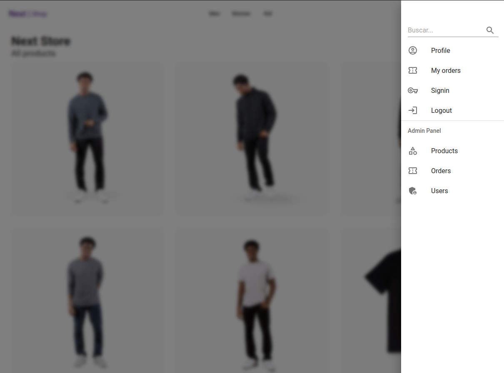
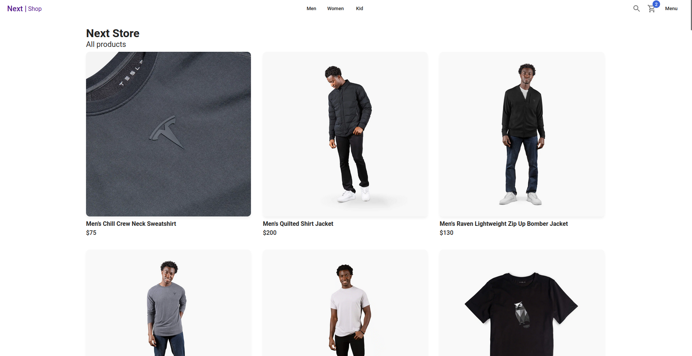
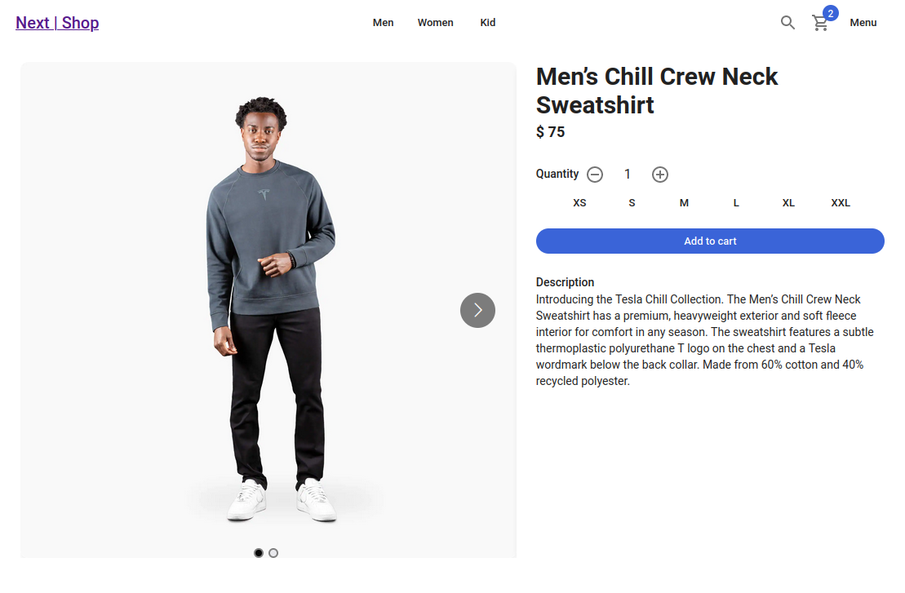
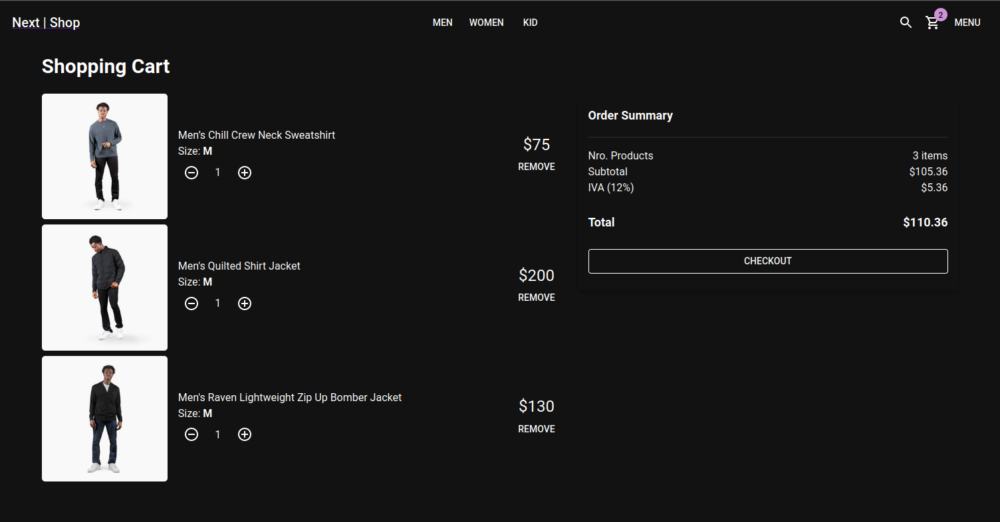
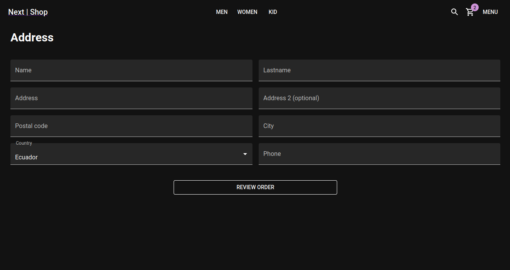
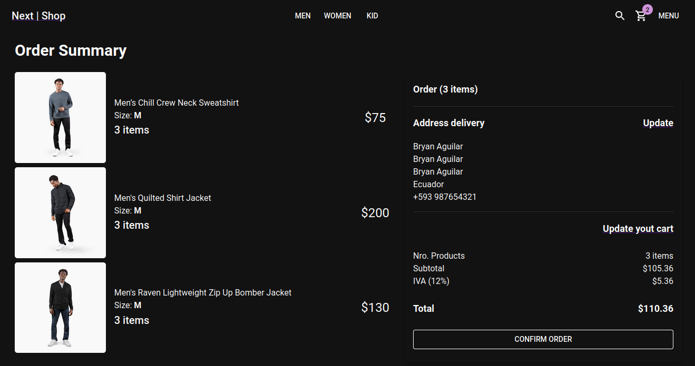
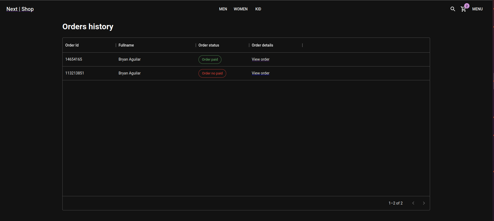
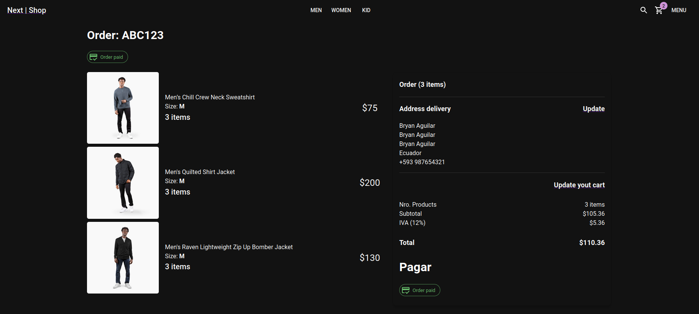

# Next Ecommerce App

This application presents a simple e-commerce application, where the user can view the products, see the detail of each product, add them to the shopping cart, see a summary of your purchase, see a history of orders placed, and other features. The application works with Next JS 13.

## Installation

Get code using

```
git clone https://github.com/baguilar6174/next-ecommerce-app.git
```

Step 2:

Install the necessary libraries (make sure you have node >= 16 and yarn)

```
yarn
```

Step 3:

Configure and start Database

```
docker-compose up -d
```

Mongo DB URL Local: `mongodb://localhost:27017/ecommercedb`

Step 4:

Configure environment variables, you need to rename `.env.template` to `.env file` and complete the values

Step 5 (optional):

You can creata fake data using the endpoint:

GET: [http://localhost:3000/api/seed](http://localhost:3000/api/seed)

Step 6:

Runs the app in the development mode

```
yarn dev
```

Open [http://localhost:3000](http://localhost:3000) with your browser to see the result.

## My process

### Build with

- Next JS 13
- React 18
- Typescript
- Material UI
- React Multi Carousel
- MongoDB

### What I learned

- Using beta app dir
- Custom MUI themes
- Responsive design
- Using Next API
- SSR
- SGR
- ISR
- Searches
- SWR for HTTP requests

## Next Ecommerce App

<table>
  <tr>
    <td align="center" valign="center"></td>
    <td align="center" valign="center"></td>
  </tr>
  <tr>
    <td align="center" valign="center"></td>
    <td align="center" valign="center"></td>
  </tr>
  <tr>
    <td align="center" valign="center"></td>
    <td align="center" valign="center"></td>
  </tr>
  <tr>
    <td align="center" valign="center"></td>
    <td align="center" valign="center"></td>
  </tr>
 </table>

## Stay in touch

- Website - [www.bryan-aguilar.com](https://www.bryan-aguilar.com/)
- Medium - [baguilar6174](https://baguilar6174.medium.com/)
- LinkeIn - [baguilar6174](https://www.linkedin.com/in/baguilar6174)
